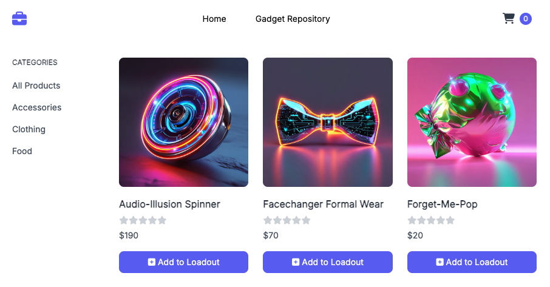
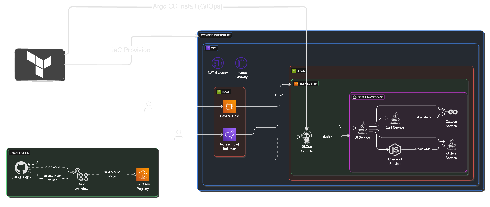

# 🛒 Retail Store ArgoCD GitOps Pipeline

A production-grade **GitOps CI/CD pipeline** for a microservices-based retail store application, deployed on **Amazon EKS** using **ArgoCD**, **GitHub Actions**, **Terraform**, and **NGINX Ingress** with automatic SSL via **cert-manager**.



> **Live Application:** [https://retail-store.arnaba075.com](https://retail-store.arnaba075.com)

---

## 📋 Table of Contents

- [Architecture Overview](#architecture-overview)
- [Branch Strategy](#branch-strategy)
- [Prerequisites](#prerequisites)
- [Infrastructure Setup (Terraform)](#infrastructure-setup-terraform)
- [GitOps Pipeline (GitHub Actions)](#gitops-pipeline-github-actions)
- [Custom Domain & SSL Setup](#custom-domain--ssl-setup)
- [ArgoCD Configuration](#argocd-configuration)
- [IAM Security (Least Privilege)](#iam-security-least-privilege)
- [Troubleshooting & Problems Fixed](#troubleshooting--problems-fixed)
- [Cleanup](#cleanup)

---

## 🏗️ Architecture Overview

The system follows a modern microservices architecture managed through GitOps principles.



### Application Components

The application consists of several microservices working together to provide a seamless shopping experience.


### Technology Stack

| Component | Technology |
|---|---|
| **Cloud Provider** | AWS (us-west-1) |
| **Kubernetes** | Amazon EKS v1.33 |
| **Infrastructure as Code** | Terraform |
| **GitOps Operator** | ArgoCD |
| **CI/CD Pipeline** | GitHub Actions |
| **Container Registry** | Amazon ECR (private) |
| **Ingress Controller** | NGINX |
| **Certificate Manager** | cert-manager (Let's Encrypt) |
| **DNS** | AWS Route53 |
| **Package Manager** | Helm |

---

## 🌿 Branch Strategy

This repository uses a **dual-branch GitOps strategy**:

| Feature | `main` branch | `gitops` branch |
|---|---|---|
| **Purpose** | Public demo / simple deploy | Production / automated CI/CD |
| **Images** | Public ECR (stable v1.2.2) | Private ECR (auto-tagged) |
| **GitHub Actions** | ❌ None | ✅ Full CI/CD pipeline |
| **ArgoCD Target** | Umbrella chart | Individual service apps |
| **Updates** | Manual | Automatic on code push |

> **Key Rule:** The `.github/workflows/` directory exists **only** on the `gitops` branch. It must never be merged into `main`.

---

## ✅ Prerequisites

| Tool | Version | Install |
|---|---|---|
| **AWS CLI** | v2+ | [Guide](https://docs.aws.amazon.com/cli/latest/userguide/install-cliv2.html) |
| **Terraform** | 1.0+ | [Guide](https://developer.hashicorp.com/terraform/install) |
| **kubectl** | 1.33+ | [Guide](https://kubernetes.io/docs/tasks/tools/) |
| **Docker** | 20.0+ | [Guide](https://docs.docker.com/get-docker/) |
| **Helm** | 3.0+ | [Guide](https://helm.sh/docs/intro/install/) |
| **Git** | 2.0+ | [Guide](https://git-scm.com/downloads) |

---

## 🚀 Infrastructure Setup (Terraform)

The infrastructure is provisioned using Terraform on Amazon EKS.


### Step 1: Configure AWS Credentials

```bash
aws configure
# Enter: Access Key ID, Secret Access Key, Region (us-west-1), Output format (json)
```

### Step 2: Clone the Repository

```bash
git clone https://github.com/ArnabAdhikar/Retail-Store-ArgoCD-Pipeline.git
cd Retail-Store-ArgoCD-Pipeline
git checkout gitops
```

### Step 3: Deploy Core Infrastructure

```bash
cd terraform
terraform init
terraform plan    # Review changes
terraform apply   # Type 'yes' to confirm
```

This provisions:
- **VPC** with public and private subnets across 2 AZs
- **Amazon EKS cluster** (`retail-store-tnoh`) with Kubernetes v1.33
- **Node groups** with managed auto-scaling
- **NGINX Ingress Controller** (exposed via AWS NLB)
- **cert-manager** for automatic SSL certificates
- **ArgoCD** installed via Helm
- **IAM GitOps user** with least-privilege policies
- **SSM Parameters** storing GitOps credentials

> ⏱️ Infrastructure provisioning takes approximately **15-20 minutes**.

---

## ⚙️ GitOps Pipeline (GitHub Actions)

The CI/CD pipeline lives in `.github/workflows/deploy.yml` on the `gitops` branch.

### Pipeline Trigger

Pushes to the `gitops` branch that modify files under `src/**` automatically trigger the workflow. It can also be run manually via `workflow_dispatch`.

---

## 🎨 UI Customization

The application supports different themes, such as the orange theme shown below.


---

## 🐛 Troubleshooting & Problems Fixed

Refer to the original documentation for detailed troubleshooting steps.

---

<div align="center">

**Built with ❤️ using AWS EKS, ArgoCD, GitHub Actions, and Terraform**

**⭐ Star this repository if you found it helpful!**

</div>
